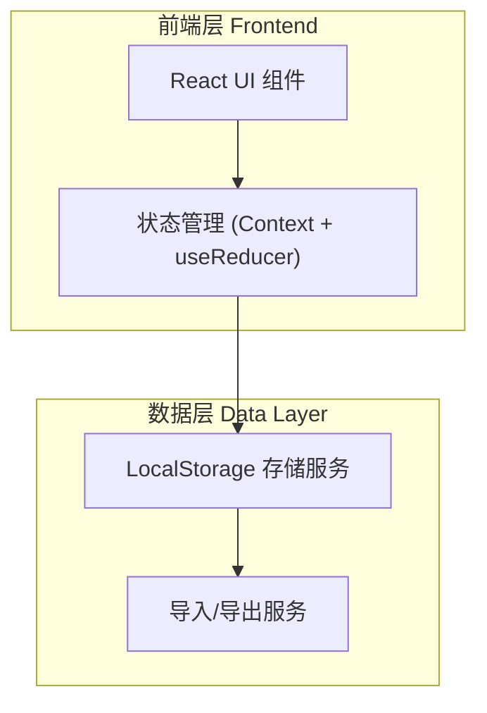
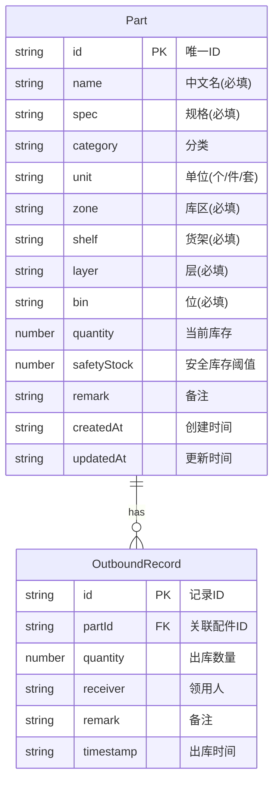

# 配件位置记忆工具 - 技术架构文档

## 1. 架构设计



纯前端架构，无后端服务。数据通过 localStorage 持久化，所有业务逻辑在前端完成，适合工厂离线环境。

## 2. 技术说明

- **前端框架**：React@18 + tailwindcss@3 + vite
- **初始化工具**：vite-init (react-ts 模板)
- **状态管理**：React Context + useReducer（轻量级，无需引入额外库）
- **持久化**：浏览器 localStorage（同步读写，数据量小适合）
- **图标**：lucide-react（线性图标，符合工业风格）
- **字体**：Noto Sans SC（中文）+ JetBrains Mono（编号/规格/位置）
- **后端**：无
- **数据库**：无（使用 localStorage）

## 3. 路由定义

| 路由 | 用途 |
|------|------|
| `/` | 配件台账首页（列表、搜索、筛选、统计） |
| `/add` | 新增配件页面 |
| `/edit/:id` | 编辑配件页面（复用新增表单） |
| `/detail/:id` | 配件详情页面（位置指引、出库记录、出库操作） |

## 4. 数据模型

### 4.1 数据模型定义



### 4.2 数据结构（TypeScript）

```typescript
interface Part {
  id: string;
  name: string;           // 中文名
  spec: string;           // 规格
  category: string;       // 分类
  unit: string;           // 单位
  zone: string;           // 库区
  shelf: string;          // 货架
  layer: string;          // 层
  bin: string;            // 位
  quantity: number;       // 当前库存
  safetyStock: number;    // 安全库存
  remark: string;         // 备注
  createdAt: string;
  updatedAt: string;
}

interface OutboundRecord {
  id: string;
  partId: string;
  quantity: number;
  receiver: string;
  remark: string;
  timestamp: string;
}
```

### 4.3 LocalStorage 键设计

- `parts_manager_parts`: 配件列表（JSON 数组）
- `parts_manager_outbound`: 出库记录列表（JSON 数组）

## 5. 关键功能实现

### 5.1 搜索逻辑
对 `name`、`spec`、`zone`、`shelf`、`layer`、`bin` 字段做不区分大小写的包含匹配，实时筛选。

### 5.2 位置路径展示
将 `zone + shelf + layer + bin` 拼接为完整位置路径，如 `A区-货架03-第2层-A位`，在详情页与表格中以高亮黄色标签展示。

### 5.3 库存预警
当 `quantity <= safetyStock` 时，在表格与详情页以橙红色标记预警状态。

### 5.4 出库操作
出库时：校验数量 > 0 且 ≤ 当前库存 → 扣减 `quantity` → 新增 `OutboundRecord` → 更新 `updatedAt`。

### 5.5 数据导入/导出
- 导出：将配件与出库记录打包为 JSON 文件下载
- 导入：读取 JSON 文件，校验格式后写入 localStorage（可选覆盖或合并）
